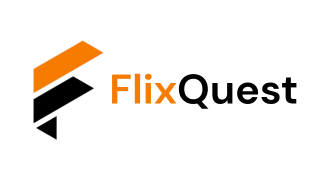
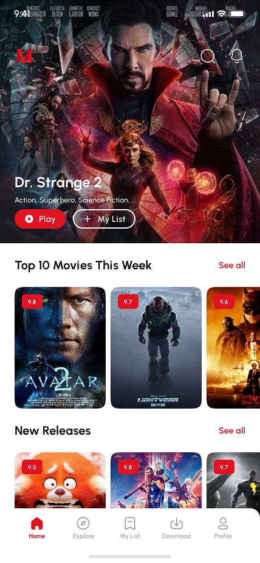
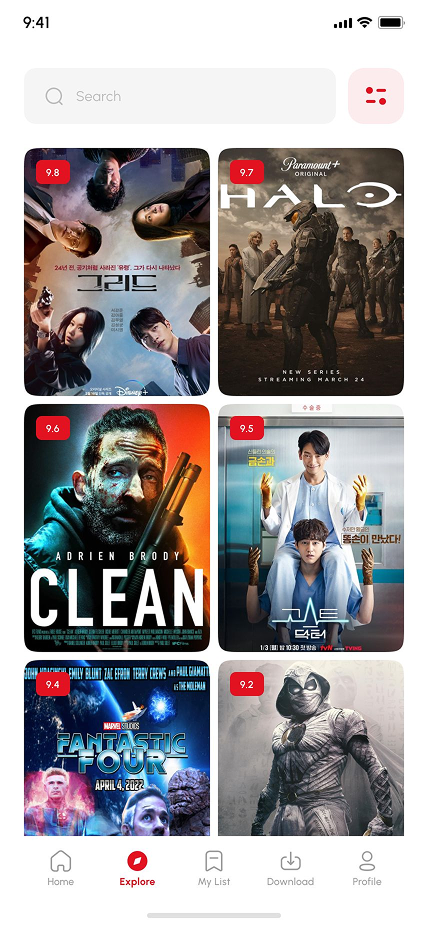

<p align="center">
  
</p>

<h1 align="center">FlixQuest</h1>

<p align="center">
  <strong>A modern, open-source streaming application for Movies, TV Shows, and Live TV built with Flutter.</strong><br>
  Optimized for <strong>Android Mobile, Tablets</strong>, and <strong>Android TV (10-Foot UI)</strong>.
</p>

<p align="center">
  
  
  
  
  
</p>

---

## ✨ Features

### 🎬 Extensive Movie & TV Show Catalog

- **Discovery Feeds**: Categorized home feeds with shimmer loading effects — Trending, Top 10 This Week, New Releases, Upcoming, and Popular.
- **Detailed Media Pages**: Media details featuring trailers, cast & crew filmographies, user reviews, and intelligent "More Like This" recommendations powered by TMDB.
- **Explore & Filter**: Filter content by genre, release year, streaming provider, country, or sort order, alongside a random discovery tool.
- **TV Seasons & Episodes**: Interactive episode browser with episode thumbnails, descriptions, air dates, and quick episode switcher sheets.

### 📺 Android TV (10-Foot UI Experience)

- **D-Pad Focus Navigation**: Native TV remote control navigation with directional keymaps and focus memory.
- **TV Home Shell & Rail**: TV navigation rail, catalog screens, and hero banners designed specifically for large screens.
- **TV Search & History**: Remote-friendly search interface with recent search query history.
- **Automatic Presentation Detection**: Automatically detects TV devices and adapts the interface between mobile touch and TV 10-foot layout.

### 📡 Free Live TV & Sports Streaming

- **Live TV Integration**: Integrated DaddyLive service providing 24/7 TV channels and scheduled live sports events.
- **Category Browsing & Search**: Search channels by name, filter by category, and view local time-formatted schedules.
- **Stream Recovery & Buffering**: Smart playback recovery (90-second window), auto-reconnect, and optimized live buffering.
- **Local Caching**: Fast SQLite caching for live channels and event schedules.

### 🚀 Multi-Source Video Providers & Scraper API v2

- **Dynamic Provider System**: Integrated with **FlixQuest Scraper API v2** for scraping high-quality streams.
- **Live Provider Health Status**: Real-time provider uptime monitoring (`/providers/status`) with in-app status indicators.
- **Direct Fallback Provider**: Built-in direct VixSrc provider fallback.
- **Custom Provider Prioritization**: Reorder and prioritize your preferred streaming providers in Settings.
- **Stream Formats**: Full support for HLS (.m3u8), DASH (.mpd), and direct MP4 streams with custom header support.

### 💬 Comprehensive Subtitle Management

- **Automatic External Subtitles**: Multi-language subtitle search and retrieval powered by Wyzie Subtitles API.
- **Local Subtitle Upload**: Pick and load local `.srt` or `.vtt` subtitle files directly from your device storage.
- **Subtitle Customization**: Adjust font size, text color, background color, and visual styling presets.
- **Encoding & HI Support**: Smart character encoding handling (UTF-8, Latin1, ASCII) and Hearing-Impaired (HI) tags.

### 📥 Offline Downloads

- **Background Downloads**: Download movies and TV episodes with background download management and progress notifications.
- **Aspect Ratio Normalization**: Built-in video exporter with square-pixel aspect ratio normalization.
- **Subtitle Bundling**: Automatically export and bundle subtitles with downloaded videos for offline viewing.
- **Offline Player**: Dedicated offline library and media player for downloaded files.

### 🎨 Modern UI, Ambient Glow & Seasonal Themes

- **Phosphor Icons**: Clean, consistent icon set using Phosphor Flutter icons across the entire app.
- **Ambient Mode**: Dynamic color palette extraction from movie/show posters and backdrops for an immersive ambient background glow.
- **Occasional & Seasonal Themes**: Dynamic holiday themes (Christmas, New Year, Halloween, Valentine's Day, Easter, Eid, Diwali, Ethiopian New Year, etc.) with animated vector particle overlays (snow, fireworks, bats, hearts, adey flowers, confetti, stars, sparkles). Configurable via Firebase Remote Config.
- **Themes**: Light, Dark, AMOLED Pure Black, and Material 3 Dynamic Color palettes.

### 🔐 User Profiles & Cloud Synchronization

- **Firebase Authentication**: User accounts with email/password authentication, profile management, and account deletion.
- **Cross-Device Bookmark Sync**: Dual-layer bookmark synchronization between local SQLite and Cloud Firestore.
- **Recently Watched & Resume**: Track watch progress across movies and episodes with quick resume playback.

### 🌍 Multi-Language Localization

- Complete internationalization powered by `easy_localization` supporting multiple languages including English, Spanish, Arabic, Hindi, and more.

---

## 📱 Screenshots

<table style="border: none;">
  <tr>
    <td></td>
    <td></td>
    <td></td>
    <td></td>
  </tr>
  <tr>
    <td></td>
    <td></td>
    <td></td>
    <td></td>
  </tr>
</table>

---

## ⚙️ Environment Variables & API Keys

FlixQuest uses `flutter_dotenv` to load environment variables. Create a `.env` file in the root directory of the project:

```env
# Required: TMDB API Key for movie and TV show metadata
TMDB_API_KEY="your_tmdb_api_key"

# Required: FlixQuest Scraper API v2 instance URL
FLIXQUEST_API_URL="https://your-flixquest-api-instance.com"

# Optional: Mixpanel project token for general analytics
MIXPANEL_API_KEY="your_mixpanel_api_key"
```

### Obtaining API Keys:

- **TMDB API Key**: Register at [The Movie Database (TMDB)](https://developer.themoviedb.org/v3/reference/intro/authentication#api-key-quick-start) to get your free API key.
- **FlixQuest Scraper API**: Deploy your own instance of the [FlixQuest API](https://github.com/BeamlakAschalew/flixquest-api) on services like Vercel, Render, or self-host via Docker.
- **Mixpanel Token** _(Optional)_: Create a free account at [Mixpanel](https://mixpanel.com).

---

## 🕷️ FlixQuest Scraper API v2

FlixQuest integrates with **FlixQuest Scraper API v2** for resolving streaming sources. The complete API contract is documented in [`openapi.json`](openapi.json).

Key endpoints consumed by the app:

- `GET /providers`: Discovers available and enabled video providers.
- `GET /providers/status`: Fetches live provider health status, latency, and uptime.
- `GET /stream-movie`: Scrapes streaming links for movies using TMDB ID.
- `GET /stream-tv`: Scrapes streaming links for TV episodes using TMDB ID, season, and episode number.
- `GET /api/v2/intro`: Retrieves branded intro video configuration.

---

## 🔥 Firebase Configuration

FlixQuest uses Firebase for several services:

| Service                       | Purpose                                                                                                                                                                             |
| ----------------------------- | ----------------------------------------------------------------------------------------------------------------------------------------------------------------------------------- |
| **Firebase Authentication**   | User authentication, profile management, and session handling.                                                                                                                      |
| **Cloud Firestore**           | Cloud bookmark synchronization across multiple devices.                                                                                                                             |
| **Firebase Remote Config**    | Dynamic configuration for app logos, seasonal themes, and vector animation effects. See [`docs/firebase_remote_config.md`](docs/firebase_remote_config.md) for full schema details. |
| **Firebase Cloud Messaging**  | Background notifications and alerts.                                                                                                                                                |
| **Firebase In-App Messaging** | Dynamic in-app banners and update notices.                                                                                                                                          |
| **Firebase Analytics**        | Usage and performance analytics.                                                                                                                                                    |

> **Note**: To connect to your own Firebase project, place your `google-services.json` inside `android/app/`.

---

## ▶️ Custom `better_player` Package

This repository uses a customized version of `better_player` (`better_player_plus`) located at [github.com/BeamlakAschalew/flixquest-betterplayer](https://github.com/BeamlakAschalew/flixquest-betterplayer).

You can configure it in `pubspec.yaml` using a local path or git URL:

```yaml
better_player_plus:
  git:
    url: https://github.com/BeamlakAschalew/flixquest-betterplayer.git
```

Or reference a local sibling directory:

```yaml
better_player_plus:
  path: ../flixquest-betterplayer
```

---

## 🛠️ Getting Started & Build Instructions

### Prerequisites

- **Flutter SDK**: `>=3.0.0 <4.0.0`
- **Dart SDK**: `^3.0.0`
- **Android SDK / NDK**: Android SDK 34+, Java 17

### Installation Steps

1. **Clone the repository**:

   ```bash
   git clone https://github.com/BeamlakAschalew/flixquest.git
   cd flixquest
   ```

2. **Clone the custom better_player repository** (if using local path):

   ```bash
   cd ..
   git clone https://github.com/BeamlakAschalew/flixquest-betterplayer.git
   cd flixquest
   ```

3. **Configure Environment Variables**:
   Create a `.env` file in the project root:

   ```bash
   cp .env.example .env # or create a new .env file with your keys
   ```

4. **Install Dependencies**:

   ```bash
   flutter pub get
   ```

5. **Run the Application**:
   - For Android Mobile / Tablet:
     ```bash
     flutter run
     ```
   - For Android TV (Emulator or connected TV device):
     ```bash
     flutter run -d <tv-device-id>
     ```

6. **Build Release APK**:
   ```bash
   flutter build apk --release
   ```

---

## 🤝 Contributing

Contributions, feature suggestions, design ideas, and translations are always welcome!

- **Pull Requests**: Please ensure your code passes static analysis and is properly formatted:
  ```bash
  dart format .
  flutter test
  ```
- **Issue Reports**: Please follow the provided issue templates when opening bugs or feature requests.

---

## ⚠️ Disclaimer

- The developers of this application have no affiliation with content providers like TMDB, DaddyLive, or any third-party streaming websites.
- FlixQuest **does not host or upload any video content**. All media is retrieved via public scrapers and third-party APIs.
- In case of copyright infringement, please contact the responsible hosting services or source providers directly.

---

<div align="center">
  <h3>Support the Project</h3>
  <a href="https://www.buymeacoffee.com/cinemaxapp">
    
  </a>
</div>

---

### 🙏 Credits & Integrations

- **TMDB API**: Media metadata, cast, crew, and artwork.
- **FlixQuest Scraper API**: Multi-source streaming scrapers.
- **DaddyLive**: Free Live TV channels and sports stream integration.
- **Wyzie API**: Multi-language subtitle discovery.
- **Phosphor Icons**: Beautiful, consistent icon pack (`phosphor_flutter`).
- **Matinee Flutter**: Initial UI inspiration and base architecture (`bimsina/Matinee-Flutter`).

---

<p align="center">
  <i>GNU, but for Entertainment</i><br><br>
  <strong>© 2022–2026 Beamlak Aschalew</strong>
</p>
